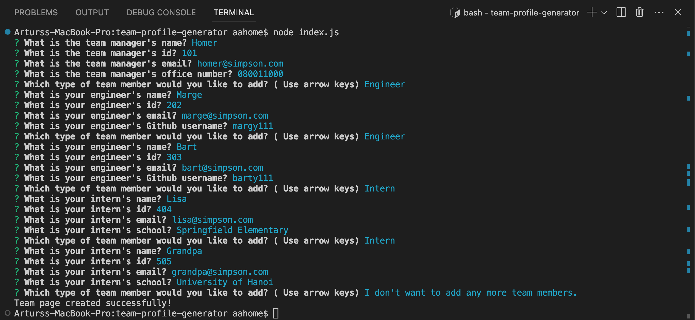
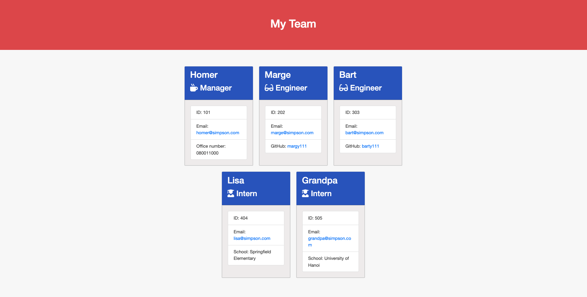

# CLI Team-Profile Generator

[](https://opensource.org/licenses/MIT)

## Description

CLI Team-Profile Generator is a Node.js command line application that generates an HTML page displaying summaries of a team's employees. The user is prompted to enter information about each employee, including their name, ID, email, and role. Depending on the employee's role, the user may be prompted to enter additional information, such as their office number (for managers), GitHub username (for engineers), or school name (for interns).

Once the user has entered information for all employees, the application generates an HTML page that displays each employee's information, along with their role-specific information, in a well-formatted table. The page also includes links to the employees' email addresses and GitHub profiles (if applicable).

## Table of Contents

  * [Installation and Usage](#installation-and-usage)

  * [Technical Aspects](#technical-aspects)

  * [License](#license)

  * [Contributing](#contributing)

  * [Screenshots](#screenshots)

  * [Demo-Video](#demo-video)

  * [Questions](#questions)

## Installation and Usage

1) Clone this repository to your local machine.

2) Open a terminal window and navigate to the root directory of the project.

3) Run ```npm install``` to install the dependencies.

4) Run ```node index.js``` to start the application.

5) Follow the prompts to enter information about your team.

6) Once all team members have been added, select the "Finish building my team" option to generate an HTML file with your team roster.

7) Open the generated HTML file in your web browser to view your team roster.

## Technical Aspects

CLI Team-Profile Generator is built using JavaScript, Node.js and the following NPM packages:

`inquirer`: for prompting the user for input and processing their responses.

`jest`: for running unit tests on the application's classes and methods.

The application uses an object-oriented design pattern, with each employee represented by a separate class (Employee, Manager, Engineer, and Intern). Each class has its own properties and methods for retrieving and displaying employee information.

The app.js file is responsible for instantiating the necessary classes and prompting the user for input. Once the user has entered information for all employees, the application uses the render method of the Renderer class to generate an HTML file containing the employee summaries.

The application includes unit tests for each class and method using Jest. To run the tests, navigate to the project directory in your terminal and run the command ```npm test```. The tests will automatically run and display their results in the terminal.

## License

MIT License

## Contributing

Fork and pull request.

## Screenshots





## Demo-Video.

[Demo-Video hosted on Google drive.](https://drive.google.com/file/d/1yOEqira-vRnQ4Xp_OJTH3HBofydJNu_F/view)

## Questions

If you have any questions or want to check out my other projects, please visit me on [GitHub](https://github.com/aboltins) or feel free to email me at <arthuraboltins@gmail.com>.